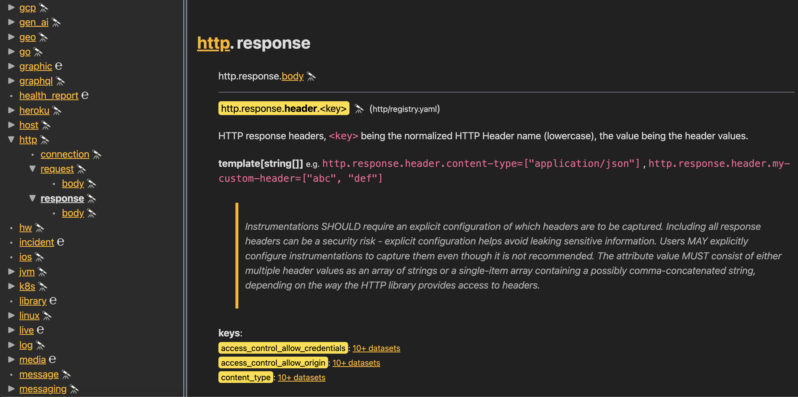

# Honey Explore

Creates a local web app for you to explore your schema compatible OpenTelemetry Semantic Conventions alongside your [Honeycomb](https://honeycomb.io) datasets.



All attributes are built into a namespace tree from any supplied Semantic Convention models. Each attribute has its documentation alongside Honeycomb datasets that have used it in the last 60 days. Clicking on a dataset name will take you to a query in the Honeycomb UI grouping by that attribute.

## Building

honey-explore is written in Rust, you'll need a
[Rust installation](https://www.rust-lang.org/) to compile it:

```shell
$ git clone https://github.com/jerbly/honey-explore.git
$ cd honey-explore
$ cargo build --release
$ ./target/release/honey-explore --version
0.1.0
```

## Usage

```text
Honey Explore

Usage: honey-explore [OPTIONS] --model <MODEL>...

Options:
  -m, --model <MODEL>...  Model paths
  -a, --addr <ADDR>       Address [default: 127.0.0.1:3000]
  -h, --help              Print help (see more with '--help')
  -V, --version           Print version
```

You must provide `HONEYCOMB_API_KEY` as an environment variable or in a `.env` file. This api key must have access to read datasets and columns, create and run queries.

You must provide at least one path to the model root directory of OpenTelemetry Semantic Convention compatible yaml files. Provide multiple root directories separated by spaces after `--model`. It is recommended to clone the [OpenTelemetry Semantic Conventions](https://github.com/open-telemetry/semantic-conventions) project and add this alongside your own Semantic Conventions. The path should be prefixed with a nickname followed by a double colon. For example: `honey-explore --model otel::/code/semantic-conventions/model`
